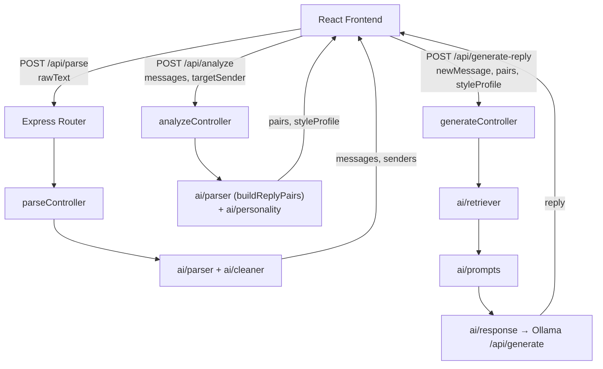

<div align="center">

# 💬 EchoMind

**Local-First AI Texting-Style Cloner, Powered by Your Own WhatsApp History**

[](https://reactjs.org/)
[](https://vitejs.dev/)
[](https://expressjs.com/)
[](https://nodejs.org/)
[](https://ollama.com/)
[](https://tailwindcss.com/)

**Runs 100% locally — no cloud LLM, no API keys, no database, no vector store.**

[Report Bug](https://github.com/Prathvikmehra/evofox/issues) · [Request Feature](https://github.com/Prathvikmehra/evofox/issues)

</div>

---

## 🌍 Project Vision

> *"Everyone texts a little differently — the slang, the emoji habits, the message length, the punctuation (or total lack of it). EchoMind turns a real chat export into a working style profile, and lets a local LLM reply the way that person actually would — with nothing ever leaving your machine."*

Paste an exported WhatsApp chat → EchoMind parses it, learns one sender's texting style from real message pairs → you type an incoming message → a locally-running LLM (via Ollama) generates a reply in that person's voice → you copy it out. No cloud fallback, no persistence, no data leaving the laptop it runs on.

---

## 📖 Introduction

EchoMind is a **decoupled full-stack app**: a **Vite + React** frontend and an **Express.js** backend, connected to a **local Ollama** model as the only network dependency.

The backend is split into a pure-logic `ai/` layer (parsing, cleaning, style profiling, retrieval, prompt building, and the Ollama call) sitting behind a thin `controllers/routes` HTTP layer — so the actual "AI" is unit-testable without spinning up Express at all. The frontend is a small, focused flow: paste → pick a sender → chat, with a style-profile card as the proof-of-learning centerpiece.

There is deliberately **no database and no embeddings** — retrieval is done with keyword-overlap scoring in plain JS, which is fast, dependency-free, and easy to reason about at chat-history scale.

---

## 🛠️ Tech Stack Architecture

### 💻 Frontend (Client-Side)
| Technology | Category | Purpose |
| :--- | :--- | :--- |
| **React 19 + Vite** | Core UI Framework | Fast dev server, instant HMR |
| **React Router 7** | Routing | Landing → Upload → Select Sender → Chat flow |
| **Tailwind CSS 4** | Styling | Utility-first styling, light/dark theme support |
| **lucide-react** | Icons | Lightweight icon set for chat/nav UI |
| **Context API** | State (theme) | Persisted light/dark mode via `ThemeContext` |

### ⚙️ Backend (Server-Side)
| Technology | Category | Purpose |
| :--- | :--- | :--- |
| **Node.js + Express** | Web Server | Minimal, fast HTTP layer for 3 endpoints |
| **Ollama (local)** | LLM Inference | `llama3.2:3b` by default — the only network call in the whole backend |
| **Plain JS keyword overlap** | Retrieval | Few-shot example selection, zero dependencies |
| **In-memory state** | Storage | No DB — frontend passes parsed data back on each call |
| **`node:test`** | Testing | Native test runner, no extra dependencies |

---

## ✨ System Features

- **🧾 WhatsApp Export Parsing** — handles 12h/24h clocks, both date orders, multi-line messages, and structurally tags system lines (joins/leaves, encryption banners) so they're never confused with real text.
- **🧹 Noise Cleaning** — strips media placeholders, missed calls, deleted messages — without false-positive matching on ordinary words like "left" or "added".
- **🧠 Style Profiling** — quantifies one sender's real voice: average word count, emoji usage (presence-ratio, not raw count), top emojis, common phrases, capitalization and punctuation style.
- **🔍 Keyword-Overlap Retriever** — pulls the most relevant real (incoming → reply) examples as few-shot context, with a random-fill fallback so the model always has *something* to anchor on.
- **🤖 Local-Only Generation** — one prompt, one call to a local Ollama instance, a 20-second hard timeout so a hung model never freezes the demo.
- **🎨 Style Profile Card** — a visual, at-a-glance proof that the app actually learned something, shown right inside the chat flow.

---

## 🏗️ System Architecture



---

## 📂 Repository Structure

```
evofox/
├── backend/
│   ├── ai/                          # Pure logic — no Express, no I/O except Ollama
│   │   ├── parser/
│   │   │   ├── parseWhatsAppText.js   # Raw export text → { timestamp, sender, text }[]
│   │   │   └── buildReplyPairs.js     # Messages → { incoming, reply }[] for one sender
│   │   ├── cleaner/
│   │   │   └── cleanMessages.js       # Strips system lines, media/call placeholders, empties
│   │   ├── personality/
│   │   │   └── buildStyleProfile.js   # Reply text → StyleProfile
│   │   ├── retriever/
│   │   │   └── findSimilarExamples.js # Keyword-overlap few-shot example selection
│   │   ├── prompts/
│   │   │   └── buildPrompt.js         # Style profile + examples + new message → LLM prompt
│   │   ├── response/
│   │   │   └── callOllama.js          # The only network call in the backend
│   │   └── tests/
│   │       ├── parser.test.js
│   │       ├── cleaner.test.js
│   │       └── personality.test.js
│   └── backend/
│       ├── package.json
│       └── src/
│           ├── app.js                 # Express app, CORS, routes, error handler, listen
│           ├── config/index.js        # PORT, OLLAMA_URL, OLLAMA_MODEL
│           ├── controllers/
│           │   ├── parseController.js
│           │   ├── analyzeController.js
│           │   └── generateController.js
│           ├── routes/
│           │   ├── parseRoutes.js     # POST /api/parse
│           │   ├── analyzeRoutes.js   # POST /api/analyze
│           │   └── generateRoutes.js  # POST /api/generate-reply
│           ├── middlewares/errorHandler.js
│           ├── services/              # scaffolded, currently empty
│           └── utils/                 # scaffolded, currently empty
│
└── frontend/
    ├── index.html
    ├── vite.config.js
    └── src/
        ├── main.jsx
        ├── App.jsx                    # Route table
        ├── context/ThemeContext.jsx   # Light/dark theme, persisted to localStorage
        ├── pages/
        │   ├── Landing.jsx            # "/"
        │   ├── Upload.jsx             # "/upload"        — paste + parse screen
        │   ├── Dashboard.jsx          # "/select-sender" — pick target sender, run analyze
        │   └── Chat.jsx               # "/chat"          — the live demo screen
        ├── components/
        │   ├── common/{NavBar,Layout,Button}.jsx
        │   ├── chat/MessageBubble.jsx
        │   └── personality/PersonalityCard.jsx
        └── services/api.js            # fetch wrappers (⚠ see Build Scope & Status)
```

`pages/Memory/`, `pages/Sources/`, `pages/Settings/`, `components/memory/`, `components/settings/`, `components/dashboard/`, `backend/models/`, `backend/vectorDB/`, and `ai/embeddings/`/`ai/chunking/` exist only as empty `.gitkeep` placeholders — intentionally unbuilt. Persistence, embeddings, and multi-session features are out of scope for this build.

---

## 📡 API Reference

Base URL: `http://localhost:3000`. All routes mounted under `/api`, plus a health check.

<details>
<summary><strong>GET /health</strong> — liveness check</summary>

**Response `200`**
```json
{ "status": "ok" }
```
</details>

<details>
<summary><strong>POST /api/parse</strong> — raw chat text → structured messages</summary>

**Body**
```json
{ "rawText": "12/07/2025, 14:30 - Alice: Hey there!\n12/07/2025, 14:31 - Bob: Hi!" }
```

**Response `200`**
```json
{
  "messages": [
    { "timestamp": "12/07/2025, 14:30", "sender": "Alice", "text": "Hey there!" },
    { "timestamp": "12/07/2025, 14:31", "sender": "Bob", "text": "Hi!" }
  ],
  "senders": ["Alice", "Bob"]
}
```

**Errors `400`** — missing/empty `rawText`; or zero parseable messages (`"Couldn't parse any messages — check the format"`).
</details>

<details>
<summary><strong>POST /api/analyze</strong> — build reply pairs + style profile for one sender</summary>

**Body**
```json
{ "messages": [ /* from /api/parse */ ], "targetSender": "Alice" }
```

**Response `200`**
```json
{
  "pairs": [{ "incoming": "what time works for you", "reply": "6pm works for me!" }],
  "styleProfile": {
    "averageWordCount": 4.2,
    "emojiUsagePercent": 38.5,
    "topEmojis": ["😂", "🙏"],
    "commonPhrases": ["lol", "fr", "no worries"],
    "capitalizationStyle": "lowercase",
    "punctuationStyle": "minimal"
  }
}
```

**Errors `400`** — missing/invalid `messages` or `targetSender`; or no reply pairs found for that sender.
</details>

<details>
<summary><strong>POST /api/generate-reply</strong> — generate a styled reply via local Ollama</summary>

**Body**
```json
{
  "newMessage": "are we still on for tonight?",
  "pairs": [ /* from /api/analyze */ ],
  "styleProfile": { /* from /api/analyze */ }
}
```

**Response `200`**
```json
{ "reply": "yeah 100% see you at 6 😂" }
```

**Errors `400`** — missing/invalid `newMessage`, `pairs`, or `styleProfile`.
**Errors `5xx`** — Ollama unreachable or timed out (20s abort — no cloud fallback).
</details>

---

## ⚙️ Installation & Setup

### 1. Repository Setup
```bash
git clone https://github.com/Prathvikmehra/evofox.git
cd evofox
```

### 2. Pull and Warm Up the Model
```bash
ollama pull llama3.2:3b
ollama run llama3.2:3b   # confirm it responds, then leave Ollama running
```

### 3. Backend
```bash
cd backend
npm install
npm run dev        # node --watch backend/src/app.js
```
Runs on `http://localhost:3000` by default:

| Variable | Default |
| :--- | :--- |
| `PORT` | `3000` |
| `OLLAMA_URL` | `http://localhost:11434` |
| `OLLAMA_MODEL` | `llama3.2:3b` |

### 4. Frontend
```bash
cd frontend
npm install
npm run dev
```
Vite dev server on `http://localhost:5173`.

---

## 🧪 Testing

```bash
cd backend
node --test ai/tests/
```
Covers the parser (both clocks, both date orders, continuation lines, system-line tagging), the cleaner (structural `__SYSTEM__` filtering vs. text-based noise filtering), and the style profiler (e.g. emoji usage is a presence-ratio per message, not a count-ratio).

---

## 🚧 Build Scope & Status

- **Frontend is currently mocked, not wired to the backend.** `Upload.jsx`, `Dashboard.jsx`, and `Chat.jsx` use in-component mock data instead of live calls. The real routes above are implemented and working standalone.
- **`frontend/src/services/api.js` targets placeholder endpoints** (`/api/upload`, `/api/chat/:id`, etc.) from an earlier design, and isn't imported anywhere yet. Rewrite it against the routes documented above as the next integration step.
- **`backend/src/services/` and `backend/src/utils/`** are scaffolded but empty — controllers call directly into `ai/` for now.

## ✅ Demo Checklist

- [ ] Ollama pulled, model tested, and **already running/warmed up** — no cloud fallback, so a cold start or crash has no backup.
- [ ] Rehearse on the actual laptop and network you'll present with.
- [ ] Have 2–3 backup chat exports ready in case a live paste has a weird format.
- [ ] Someone who didn't build a given feature tests it cold, like a judge would.
- [ ] One-sentence pitch memorized: who'd use this and why they'd value it.
- [ ] Only your own / consenting teammates' chat data — never wired to real unsuspecting contacts.

---

## 👨‍💻 Author

**Prathvik Mehra**
- [GitHub](https://github.com/Prathvikmehra)

<div align="center">

### 💬 Same words, same voice — just running on your own machine.

[Back to Top](#-echomind)

</div>
